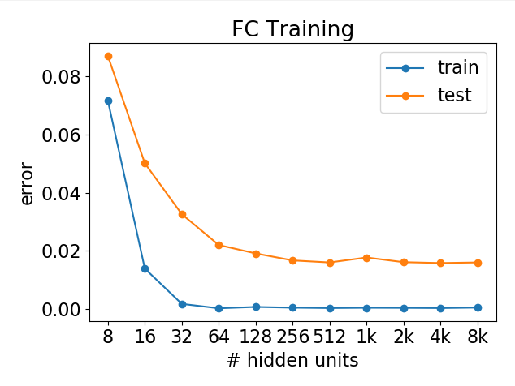
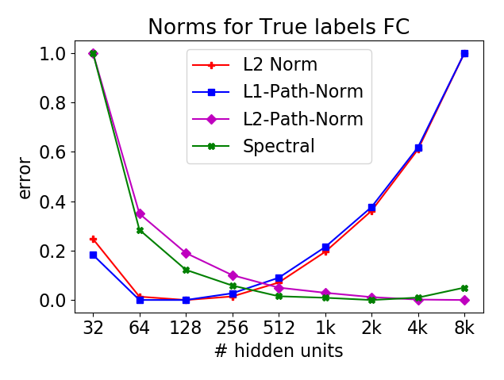
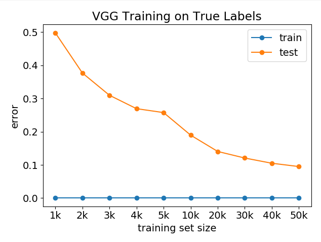
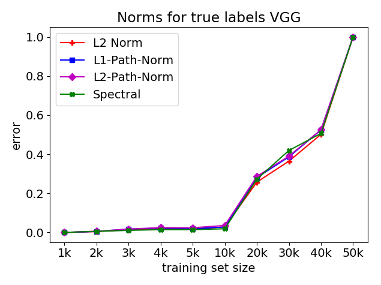

# Exploring Generalization in Deep Learning
This is a comparative experimental study on generalization in deep learning and deals with the search of a complexity measure which can explain generalization of trained models. The goals is to analyze generalization behavior with respect to difference in 1) model architecture and 2) training set size. For this, a vgg network is trained with various training subsets of CIFAR10, as well as CIFAR10 subsets with random labels. Furthermore, I set these experiements in contrast to a fully connected two-layer perceptron with a variying number of hidden units.
The attached paper analyzes the results in comparison to the results in the following paper:

**[Exploring Generalization in Deep Learning.](https://arxiv.org/abs/1805.12076)**  
[Behnam Neyshabur](https://www.neyshabur.net), [Srinadh Bhojanapalli](http://ttic.uchicago.edu/~srinadh/), [David McAllester](http://ttic.uchicago.edu/~dmcallester/), [Nathan Srebro](http://www.ttic.edu/srebro).  
Neural Information Processing Systems (NIPS), 2017


## Set Up
1. Install a recent Anaconda environment, or *Python 3.6*, *PyTorch 1.1.0* and *Numpy 1.16.3*
2. Clone the repository:
   ```
   git clone https://github.com/christina-aigner/exploring-generalization-in-deep-learning
   ```

## Training
To run a training session of a FC with MNIST run the following command and specify the number of hidden units:
   ```
   cd src
   python train.py --network=fc --numhidden=16 --dataset=MNIST
   ```
   For training a VGG on CIFAR Subset (choose --trainingsetsize accordingly) run:
   ```
   cd src
   python train.py --network=vgg --trainingsetsize=5000 --dataset=CIFARSubset
   ```
   For training random labels on a CIFAR Subset use:
   ```
   cd src
   python train.py --network=vgg --trainingsetsize=5000 --dataset=CIFARSubset --randomlabels=True
   ```
 
### Inputs Arguments for Training
* `--datadir`: path to the directory that contains the datasets (default: ../datasets)
* `--dataset`: name of the dataset(options: MNIST | CIFARSubse, default: MNISTt)
* `--network`: architecture(options: vgg | fc, default: fc).
* `--hiddenunits`: number of hidden units
* `--trainingsetsize`: training set size of CIFAR10
* `--randomlabels`: Weather to traing with random labels (options: True | False, defaut: False)
* `--epochs`: Number of maximal epochs to train
* `--saveepochs`: List of epochs where the model should be saved as checkpoint

## Evaluation
Evaluation of a set of previously trained models.
To evaluate the saved models of FC with varying number of hidden units, run:
   ```
   cd src
   python evaluate.py --savedmodels=fc
   ```
To evaluate the saved models of VGG with varying number of training set sizes, run:
   ```
   cd src
   python evaluate.py --savedmodels=vgg
   ```

### Inputs Arguments for Evaluation
When evaluated this saved models in this repo:
* `--savedmodels`: collection of saved models (options: vgg | fc)

When evaluating a single model:
* `--modelpath`: path to the directory that contains the model checkpoint to be evaluated
* `--datadir`: path to the directory that contains the datasets (default: ../datasets)
* `--dataset`: name of the dataset(options: MNIST | CIFARSubse, default: MNISTt)
* `--network`: architecture(options: vgg | fc, default: fc).
* `--hiddenunits`: number of hidden units
* `--trainingsetsize`: training set size of CIFAR10
* `--randomlabels`: Weather to traing with random labels (options: True | False, defaut: False)


### Output
When running the above two evaluations of the models trained with random labels, the following output on the training as well as the calculation of norms is generated:
Sharpness is optional and not included in this plot.

 
 

